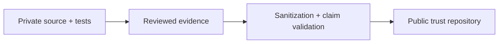

# Public evidence publication policy

A fact moves from private implementation into this public repository only when it passes four tests.

| Test | Question |
| --- | --- |
| **Useful** | Does publication improve a user, partner or assessor's trust decision? |
| **True** | Is it supported by current implementation or evidence? |
| **Scoped** | Does the claim name the release, path or boundary needed to avoid overgeneralization? |
| **Safe** | Does disclosure avoid credentials, provider topology, operational thresholds and bypass-sensitive detail? |

Failure of any test keeps the detail private.

## One-way evidence export

The public repository is never a production dependency.

## Publication rule

Historical internal documentation is never mirrored wholesale. Public status must be generated or reviewed from current release evidence so old operational notes cannot silently become current public claims.
