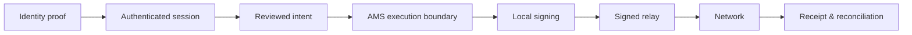

  

  

  <strong>Protocol · Trust · Public Evidence</strong> 
  The alliance-native trading network.

  
  &nbsp;&nbsp;
  
  &nbsp;&nbsp;
  
  &nbsp;&nbsp;
  
  &nbsp;&nbsp;
  

---

## One market surface

Rtp.Fun connects **discovery, execution, launch workflows and persistent trading communities** in one operating surface.

| Layer | Product surface | Public purpose |
| --- | --- | --- |
| **Discover** | Signals · Pulse · Calls · Trackers | Turn fragmented market activity into reviewable opportunities. |
| **Trade** | Trade · Swap · Portfolio | Keep review, execution and account context in one terminal. |
| **Launch** | Self launch · Multi-route · Rooms | Coordinate launch workflows through one execution boundary. |
| **Coordinate** | Alliances · Calls · Rankings · Rooms | Give trading communities persistent identity and operating surfaces. |
| **Automate** | Rule-based tools and assisted workflows | Reduce repetitive work without removing wallet policy boundaries. |
| **Own** | AMS · Pocket · Portfolio | Separate identity from execution and keep signing under user control. |

> **Public scope rule:** a connected chain, venue or provider is not automatically represented as production-observed. Capability status is release- and path-scoped.

## Product surfaces

<table>
<tr>
<td width="50%">
  
   <strong>Discover → Signals</strong> 
  Market discovery stays close to the next reviewable action.
</td>
<td width="50%">
  
   <strong>Trade → Review before execution</strong> 
  Amount, route and fees stay visible before signing.
</td>
</tr>
<tr>
<td width="50%">
  
   <strong>Launch → One review model</strong> 
  Launch workflows use the same execution trust boundary.
</td>
<td width="50%">
  
   <strong>Coordinate → Alliances</strong> 
  Calls, rooms, members and launch coordination become persistent product surfaces.
</td>
</tr>
</table>

  <a href="https://rtp.fun/docs/"><strong>Official product documentation →</strong></a>

## AMS Trust Profile

AMS is the architectural name for Rtp.Fun's **execution-wallet boundary**. The end-user documentation refers to the user-facing surface simply as the Wallet.

Public security objectives:

- **Identity and execution are separate roles.**
- **AMS private-key material is designed to remain inside the wallet-origin boundary.**
- **Prepared transactions are checked against reviewed intent, authorization and policy before local signing.**
- **Expired or locked execution state fails closed.**
- **Ambiguous execution outcomes are reconciled instead of blindly retried.**

This repository publishes the **control objective and evidence boundary**, not bypass-sensitive verifier internals, provider topology or production configuration.

[AMS public profile →](docs/ams/README.md) · [Threat model →](docs/ams/threat-model.md)

## Assurance registry

Rtp.Fun uses narrow evidence labels instead of blanket words such as “audited” or “certified”.

| Label | Meaning |
| --- | --- |
| **Designed Against** | Architecture or a control is intentionally designed with a published standard or security objective in mind. |
| **Conformance Evidence** | Automated or reviewable evidence supports the stated contract. |
| **Production Observed** | The stated behavior has been observed on the named production path. |
| **Independently Assessed** | A named independent third party has assessed the stated scope. |

| Public record | Issuer | Evidence class | State |
| --- | --- | --- | --- |
| AMS Trust Profile | Rtp.Fun | Architecture + implementation-backed conformance | **Published** |
| Public Claims Registry | Rtp.Fun | Machine-readable scoped claims | **Published** |
| Release Conformance Record | Rtp.Fun | Release-specific tests / digests | **Framework published** |
| Production Observation Record | Rtp.Fun | Chain/path-specific observation | **Release-scoped** |
| Independent Security Assessment | Named third party | External assessment | **Not published** |

**Internal evidence is never presented as an external certificate.**

## Standards crosswalk

| Area | Reference | Public posture |
| --- | --- | --- |
| Password-based KDF | RFC 9106 / Argon2id | Designed Against |
| Authenticated encryption | AES-GCM / NIST SP 800-38D | Designed Against |
| Web application controls | OWASP ASVS 5.0.0 | Control mapping |
| Secure SDLC | NIST SSDF SP 800-218 v1.1 | Process crosswalk |
| Supply-chain provenance | SLSA v1.2 | Release-evidence target |
| SBOM | SPDX 3.0 / ISO/IEC 5962:2021 | Evidence-format target |
| Wallet derivation | BIP-39 / BIP-32 / SLIP-0010 | Protocol profile |

**Mapping is not certification.** Rtp.Fun does not claim ISO, NIST, OWASP or SLSA certification unless a separately verifiable certification or assessment exists for the named scope.

[Standards crosswalk →](docs/assurance/standards-crosswalk.md)

## Verifiable fair launch

Rtp.Fun intends any native-token launch to be **publicly verifiable, not merely described as fair**.

The public framework is designed to publish, where applicable, the launch transaction, total supply, allocation policy, private-sale / presale status, authority state, treasury policy, manifest digest and distribution evidence.

No token-holder revenue-distribution, dividend or profit-sharing right is represented by this repository unless and until the legal structure, governance policy and enforceable implementation are separately approved and published.

[Fair-launch principles →](docs/token/fair-launch-principles.md)

## Disclosure boundary

| Public | Private |
| --- | --- |
| Product capabilities and user-visible behavior | Provider topology and failover order |
| Custody and execution trust boundaries | Private routing priority and quotas |
| Standards mappings and control objectives | Anti-abuse / fraud thresholds |
| Scoped claims and release evidence | Production hosts, credentials and service topology |
| User-verifiable public references | Database schema and operational secrets |
| Independent reports, when they exist | Bypass-sensitive verifier fingerprints |

**Open the proof. Keep the machinery private.**

## Repository map

| Area | Purpose |
| --- | --- |
| [`PRODUCT.md`](PRODUCT.md) | Product model and public capability language |
| [`ARCHITECTURE.md`](ARCHITECTURE.md) | Public architecture and trust boundaries |
| [`SECURITY.md`](SECURITY.md) | Security and responsible disclosure policy |
| [`STATUS.md`](STATUS.md) | Evidence vocabulary and status rules |
| [`docs/ams/`](docs/ams/) | AMS public trust and threat model |
| [`docs/assurance/`](docs/assurance/) | Standards, evidence and certificate policy |
| [`docs/token/`](docs/token/) | Fair-launch verification framework |
| [`claims/`](claims/) | Machine-readable public claims |
| [`schemas/`](schemas/) | Public claim and evidence schemas |
| [`evidence/`](evidence/) | Release-evidence format |

---

   
  Community-driven markets with a verifiable execution boundary.

