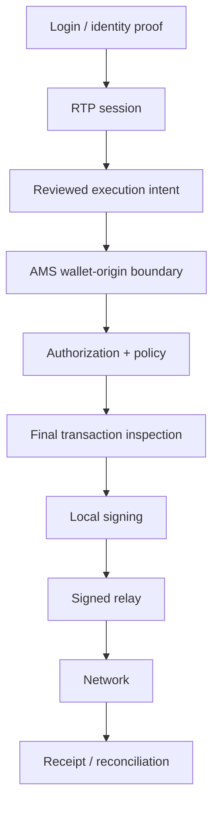

# AMS Public Trust Profile

AMS is Rtp.Fun's **execution-wallet architecture**. The public profile explains the security contract without publishing implementation detail that would materially increase attack surface.

## Public contract

| Property | Public statement |
| --- | --- |
| Identity | Login establishes account identity. It is not execution authority. |
| Execution | AMS is the wallet role used for Trade, Swap, Launch and supported Tools actions. |
| Key custody | Signing material is designed to remain inside the wallet-origin boundary. |
| Signing | Prepared transactions are inspected before local signing. |
| Authorization | Execution binds reviewed intent, wallet context, policy and bounded authorization state. |
| Ambiguity | Indeterminate execution is reconciled before replacement action. |
| Server role | Servers may prepare, validate, authorize and relay; they are not represented as the AMS signer. |

## Public flow

## What this profile does not publish

This document deliberately omits:

- exact abuse-prevention thresholds;
- provider topology and commercial routing rules;
- internal service routes;
- production host information;
- credentials;
- private verifier fingerprints;
- operational secrets.

For end-user wallet guidance, use the official documentation:

https://rtp.fun/docs/using/wallet/
